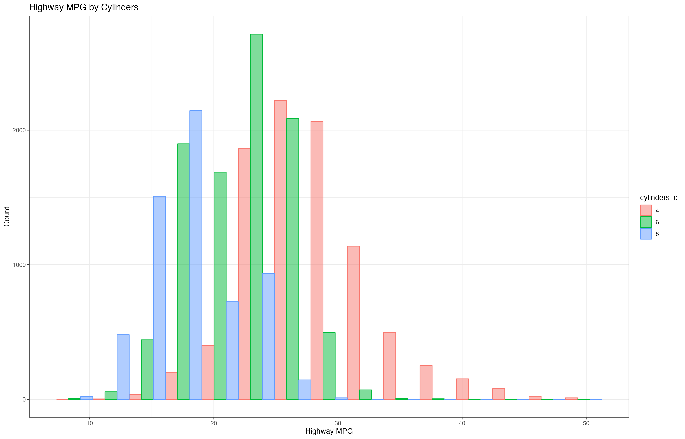
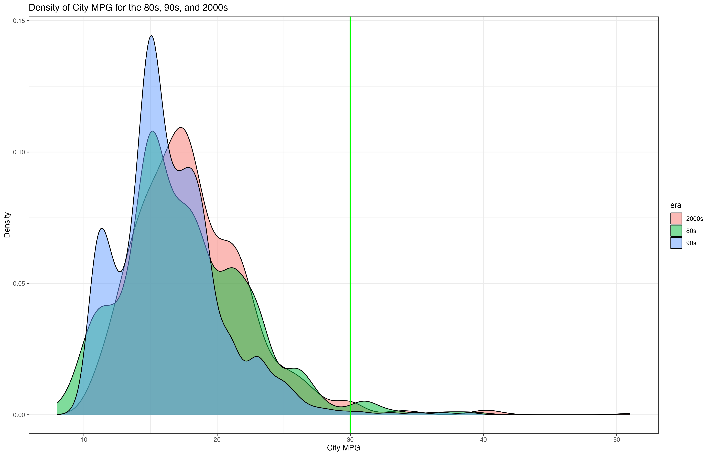
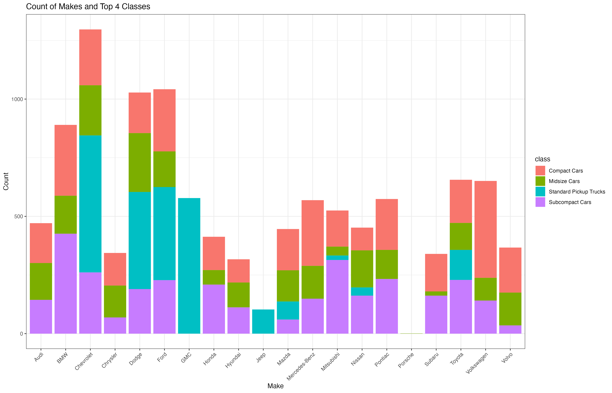
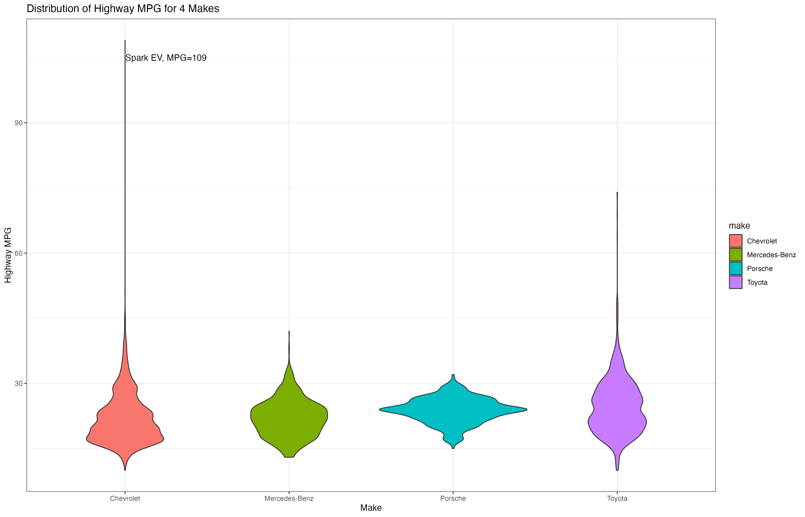
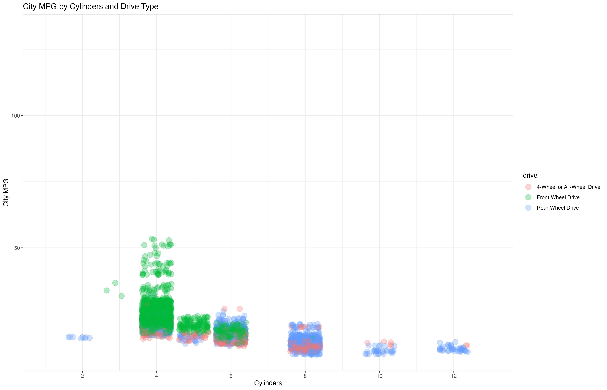
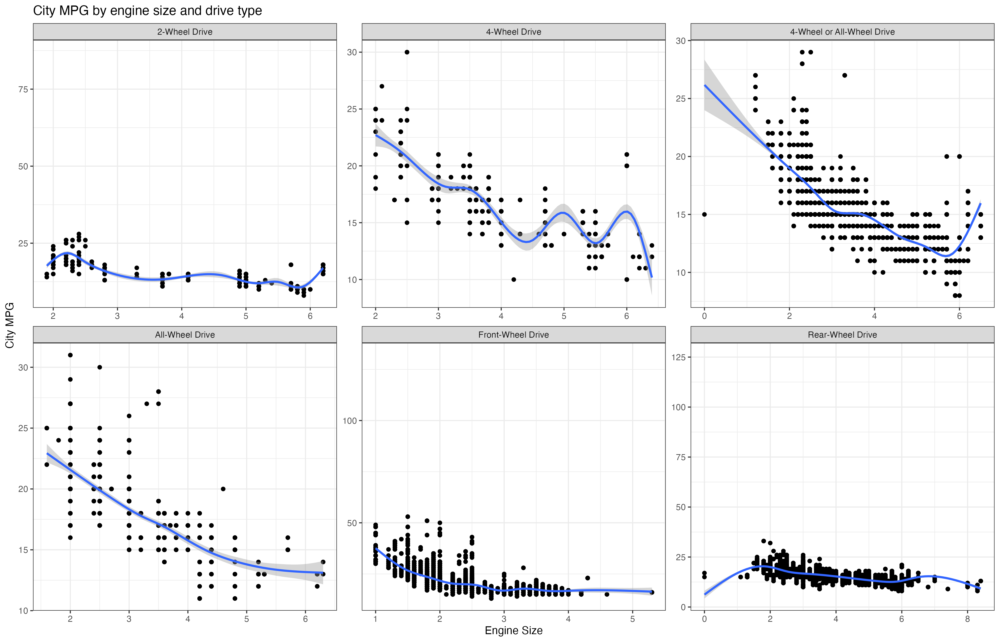
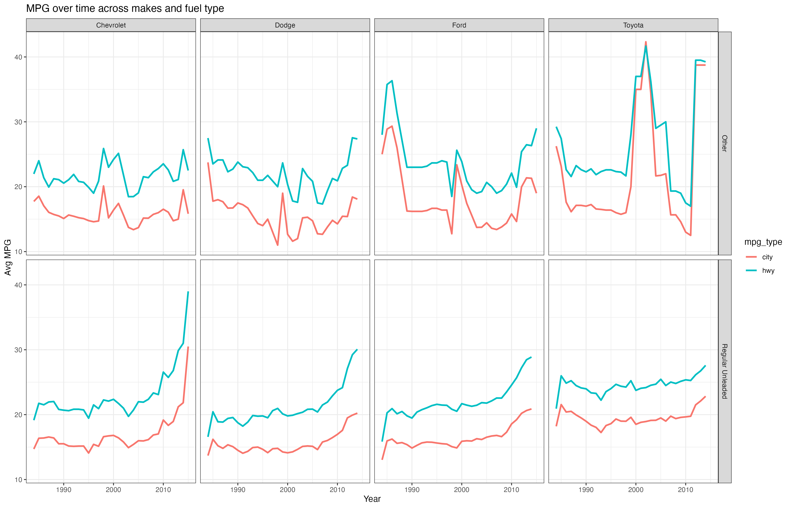

# Data Visualization Case Assignment

As usual, I've provided some starter code in the `visualization_case.R` file. You can write all of your code in that file from within RStudio, then save your changes, commit, and push those changes to GitHub before the deadline to submit.

---

# Assignment Instructions

This case is a bit different from the previous assignments because we'll be mostly just be making a bunch of plots to learn the basics of the amazing `ggplot` visualization package. So you'll see the "answers" below take the form of the plots you'll be aiming for. In each problem, I'm also having you do a bit of data manipulation before starting to create your plot, I'll show you the dataset answer like I've done on past assignments. Each of these tibbles should also be saved along the way.

**ATTENTION**: Just like the last assignment, I'm going to refrain from incorporating any trickery into the data we'll be using. This is because we're going to just focus on learning a subset of the fairly complicated functionality found in `ggplot`, and I dont want you looking over your shoulder trying to guess if there are any "gotchas". Just focus on getting the basics of visualization down. (Our next major case assignment will _definitely_ include some nice messiness for you to discover. Consider yourself warned.)

---

All of the problems in this assignment will use a large dataset that contains vehicle fuel efficiency data from the EPA. Use the provided command to read the data into the `cars` object as a tibble.

The first chart will be a histogram that summarizes the distributions of highway gas mileage across three different groups of engine cylinder counts. You'll first need to filter the `cars` data to include only cars that have 4, 6, or 8 cylinders. Now you'll need to mutate a column called `cylinders_c` that can serve as an effective _color grouping_ variable. (In other words, the plain old `cylinders` column isn't going to work for the chart below because of its data type.) Select only the `make`, `model`, `mpg_hwy`, and `cylinders_c` columns. After you have accomplished the data manipulations above, save the result to a new (typo-resistant!) tibble called `data_1`. 

>_The data in `data_1` should look like so:_

```
# A tibble: 24,369 × 4
   make  model       mpg_hwy cylinders_c
   <chr> <chr>         <dbl> <fct>      
 1 Audi  100              23 6          
 2 Audi  100              22 6          
 3 Audi  100              24 6          
```

Using `data_1` as the input data, create a plot that meets the following criteria:

- The plot should show a histogram of highway gas mileage.
- Both the color and fill should be mapped to your newly created `cylinders_c` column.
- The histogram should have 15 bins.
- All bars in the histogram should have an alpha of 0.5.
- The plot should have nice text for the title, x-, and y-axis labels as shown in the image below.
- The plot should also have the `theme_bw()` theme applied so that it is formatted to match the image below.
- Once you have it working, make sure to **save your ggplot object** to a separate object called `plot_1`.

>_Hint: Remember to play around with the `position` attribute if your bars aren't situated like you see below._ 




##### Data for this problem should be saved to `data_1` and the plot should be saved to `plot_1`.

---

Let's see if gas mileage shows any signs of improving over time. Starting with the `cars` data, filter the data to include only data from three separate years: 1985, 1995, and 2010. Now create a new column called `era` with the following labels, corresponding to each of those three years: "80s", "90s" and "2000s", respectively. Select only the `make`, `model`, `mpg_city`, and `era` columns. After you have accomplished these data manipulations, save the result to a new tibble called `data_2`. 

>_The data in `data_2` should look like so:_

```
# A tibble: 2,863 × 4
   make  model         mpg_city era  
   <chr> <chr>            <dbl> <chr>
 1 Audi  4000s               21 80s  
 2 Audi  4000s               21 80s  
 3 Audi  4000s quattro       16 80s  
```

Using `data_2` as the input data, create a plot that meets the following criteria:

- The plot should show a density curve of city gas mileage for each of the three eras.
- The fill should be mapped to your newly created `era` column.
- All density curves should have an alpha of 0.5.
- There should be a vertical reference line at MPG=30 with color = "green".
- The plot should have nice text for the title, x-, and y-axis labels as shown in the image below.
- The plot should also have the `theme_bw()` theme applied so that it is formatted to match the image below.
- Once you have it working, make sure to **save your ggplot object** to a separate object called `plot_2`.




##### Data for this problem should be saved to `data_2` and the plot should be saved to `plot_2`.

---

Starting again with the `cars` data, filter the data to include only data from the top 4 most common values in the `class` column. Select only the `make` and `class` columns. After you have accomplished these data manipulations, save the result to a new tibble called `data_3`. 

>_The data in `data_3` should look like so:_

```
# A tibble: 11,064 × 2
   make  class       
   <chr> <chr>       
 1 Audi  Midsize Cars
 2 Audi  Midsize Cars
 3 Audi  Midsize Cars
```

Using `data_3` as the input data, create a plot that meets the following criteria:

- The plot should show a bar chart summarizing the counts of vehicles from each make.
- The bars should be stacked as shown in the image.
- The labels along the x-axis should be rotated on a 45-degree angle as shown in the image.
- The plot should have nice text for the title, x-, and y-axis labels as shown in the image below.
- The plot should also have the `theme_bw()` theme applied so that it is formatted to match the image below.
- Once you have it working, make sure to **save your ggplot object** to a separate object called `plot_3`.

>_Hint 1: We didn't talk about axis label rotation in class, but the basic idea is that you'll be adding a "theme override" to apply a custom setting to the `axis.text.x` element. You'll probably want to use the `element_text()` helper to set that value, which will let you set the angle as well as a vertical and horizontal adjustment. (And because it's hard to tell from looking at the image below, I'll just tell you that the values for vertical and horizontal adjustment should both be exactly 1.)_

>_Hint 2: If your "theme override" doesn't seem to be working, remember that the order in which you add plot elements matters._




##### Data for this problem should be saved to `data_3` and the plot should be saved to `plot_3`.

---

Starting again with the `cars` data, filter the data to include only data from the following 4 makes: Chevrolet, Porsche, Mercedes-Benz, Toyota. Select only the `make` and `mpg_hwy` columns. After you have accomplished these data manipulations, save the result to a new tibble called `data_4`. 

>_The data in `data_4` should look like so:_

```
# A tibble: 6,969 × 2
   make      mpg_hwy
   <chr>       <dbl>
 1 Chevrolet      22
 2 Chevrolet      20
 3 Chevrolet      17
```

Using `data_4` as the input data, create a plot that meets the following criteria:

- The plot should show a violin plot summarizing the distribution and comparative highway MPG of vehicles from each make.
- The plot should display the same color pattern as you see in the image.
- As you can see, there is an extremely efficient vehicle from Chevrolet. Add an annotation that explains which model is so high, as well as the Highway MPG for that model.
- The plot should have nice text for the title, x-, and y-axis labels as shown in the image below.
- The plot should also have the `theme_bw()` theme applied so that it is formatted to match the image below.
- Once you have it working, make sure to **save your ggplot object** to a separate object called `plot_4`.

>_Hint: Because it will be hard to see what the coordinates of that annotation are, here they are: x = 1.25, y = 105. Note also that, depending on various things like screen size and aspect ratio of your plot preview pane, the position of your annotaion may not match up exactly with what you see below. Don't worry - that won't affect your grade as long as you've specified the annotation correctly._




##### Data for this problem should be saved to `data_4` and the plot should be saved to `plot_4`.

---

Starting again with the `cars` data, filter the data to include only data from 2008 or later with the following drive values: "4-Wheel or All-Wheel Drive" (quotes added here to make it clear that the preceeding value is all one string.), Front-Wheel Drive, and Rear-Wheel Drive. (Keep all columns.) After you have accomplished these data manipulations, save the result to a new tibble called `data_5`. 

>_The data in `data_5` should look like so:_

```
# A tibble: 4,574 × 11
   make  model  year class   trans…¹ drive cylin…² eng_s…³ fuel  mpg_hwy
   <chr> <chr> <dbl> <chr>   <chr>   <chr>   <dbl>   <dbl> <chr>   <dbl>
 1 Audi  A3     2008 Small … Automa… Fron…       4       2 Prem…      29
 2 Audi  A3     2008 Small … Manual… Fron…       4       2 Prem…      29
 3 Audi  A3     2009 Small … Manual… Fron…       4       2 Prem…      30
```

Using `data_5` as the input data, create a plot that meets the following criteria:

- The plot should show a scatter plot of city MPG vs. cylinders.
- Color should be mapped to the drive values.
- Because there are many cars with the same cylinder values, you should add some random separation to the points. (Frankly, it won't help much in terms of differentiating the mass of points, but let's do it anyway.)
- The points should all be the same size, equal to 4 and have an alpha value of 0.3.
- The x-axis should range from 1 to 13 and have breaks every 2 cylinders from 2 to 12 as shown.
- The plot should have nice text for the title, x-, and y-axis labels as shown in the image below.
- The plot should also have the `theme_bw()` theme applied so that it is formatted to match the image below.
- Once you have it working, make sure to **save your ggplot object** to a separate object called `plot_5`.

>_Hint: You can get very particular about x-axis limits and breaks using the `scale_x_continuous()` scaler element._




##### Data for this problem should be saved to `data_5` and the plot should be saved to `plot_5`.

---

Starting again with the `cars` data, filter to rows containing any drive type _other_ than "Part-time 4-Wheel Drive", then select just the `eng_size`, `mpg_city`, and `drive` columns. After you have accomplished these data manipulations, save the result to a new tibble called `data_6`. 

>_The data in `data_6` should look like so:_

```
# A tibble: 25,384 × 3
   eng_size mpg_city drive            
      <dbl>    <dbl> <chr>            
 1      2.3       17 Front-Wheel Drive
 2      2.3       16 Front-Wheel Drive
 3      2.3       16 Front-Wheel Drive
```

Using `data_6` as the input data, create a plot that meets the following criteria:

- The plot should show a scatter plot showing the relationship between `eng_size` and `mpg_city`. (See the sample image for the proper axes.)
- In addition to the scatter points, add a second geometry (`geom_smooth()`). 
- (You can keep the defaults for both the scatter and smoother geometries.)
- Use a facet_wrap to generate the set of facet panels you see in the image below. (Note that the _scales_ for each of the facets are not the same.)
- The plot should have nice text for the title, x-, and y-axis labels as shown in the image below.
- The plot should also have the `theme_bw()` theme applied so that it is formatted to match the image below.
- Once you have it working, make sure to **save your ggplot object** to a separate object called `plot_6`.

>_Hint 1: Remember that adding additional geometries is as simple as adding more layers._
>_Hint 2: `facet_wrap()` will be your friend here, and I'll note again that the **scales** of each of the facets appears to be different, depending on what data is found in each facet. (This is easier than it sounds!)_




##### Data for this problem should be saved to `data_6` and the plot should be saved to `plot_6`.

---

Alright buckle up for this one. (No pun intended.) You're about to flex nearly every data manipulation muscle you've developed over the past few weeks. Ready? 

Starting again with the `cars` data, manipulate the data as follows: 

- add a new column called `fuel_group` that has the value of "Regular Unleaded" when the `fuel` is "Regular" and otherwise has the value of "Other".
- filter the data to only these 4 makes: Chevrolet, Ford, Dodge, Toyota.
- summarize the city and highway MPG by `make`, `year`, and `fuel_group` as averages. (Remember to use `na.rm = T` just in case.) The summarized columns should be called simply `city` and `hwy`.
- pivot those two mean columns to long format so that the `city` and `hwy` columns are now in a column called `mpg_type` and their corresponding values are in a column called `mpg`

Still with me? After doing all of the above, you should be left with  a tibble with 5 columns that you can save to a new tibble called `data_7`. 

>_The data in `data_7` should look like so:_

```
# A tibble: 498 × 5
# Groups:   make, year [126]
   make       year fuel_group     mpg_type   mpg
   <chr>     <dbl> <chr>          <chr>    <dbl>
 1 Chevrolet  1984 Other          city      17.7
 2 Chevrolet  1984 Other          hwy       22.0
 3 Chevrolet  1984 Regular Un..   city      14.7
```

Using `data_7` as the input data, create a plot that meets the following criteria:

- The plot should show a line graph depicting how MPG has changed over time (i.e., over years).
- Because you pivoted the data so masterfully above, you can map the `mpg_type` column onto the color aesthetic and create two different lines, one for city MPG and one for highway MPG. (And don't worry if your lines look funky before you get to the end. We have to break up the data across the other two categories [`make` and `fuel_group`] before it will look right.)
- The lines should all have a size of 1.
- The line graphs should be _faceted_ in a grid format with vehicle `make` from left to right and `fuel_group` from top to bottom.
- The plot should have nice text for the title, x-, and y-axis labels as shown in the image below.
- The plot should also have the `theme_bw()` theme applied so that it is formatted to match the image below.
- Once you have it working, make sure to **save your ggplot object** to a separate object called `plot_7`.

>_Hint 1: This is a big one, but just take it step by step. You already know how to do all of the data manipulation steps, and the visualization steps are all familiar except maybe the facet piece._
>_Hint 2: `facet_grid()` will be your friend here._




##### Data for this problem should be saved to `data_7` and the plot should be saved to `plot_7`.

---

## Final Cleanup and Submission

### Final Run

Please do the following to make sure your code runs without errors and to make sure that you have the same objects in memory as the list below: 
1. Restart your R session (Session >> Restart R).
2. Run your entire script from the beginning, watching for any errors along the way.
3. After your script is finished, use the following command to see what objects are in memory at the end of your script: `ls() %>% tibble() %>% print(n=30)`. You can compare your output to mine below and make sure that everything is named properly and exists:

```
    1 cars  
    2 data_1
    3 data_2
    4 data_3
    5 data_4
    6 data_5
    7 data_6
    8 data_7
    9 plot_1
   10 plot_2
   11 plot_3
   12 plot_4
   13 plot_5
   14 plot_6
   15 plot_7   
```
### Housekeeping

Once you have completed the steps in the prior section, please check all of the following and make adjustments as needed. (Failure to do the housekeeping steps below will likely cause an error in our grading process, and that will make it hard to give you the right credit for your hard work.)

1. If you used the `setwd()` command near the beginning of the script, please COMMENT OUT that line before committing and pushing your code.
2. Please also comment out any code where you are either using the `View()` or `glimpse()` functions. These cause issues with our grading procedures.
3. If you installed any new packages as you completed the assignment (using `install.packages()`), please comment those installation commands out as well.
4. Lastly, please ensure that you have **NO** absolute references in your code that are not commented out. (An absolute reference is something like: `/Users/YourName/Documents/GitHub/...` or `C:/GitHubProjects/...`.) These also throw errors and make it hard for us to grade your work.

## Save, Commit, Push

You're now ready to do all three of the following:

1. Save your script.
2. Do a final commit with your git tool to stage your work for submission.
3. Push your changes up to your repository. And you're done!
